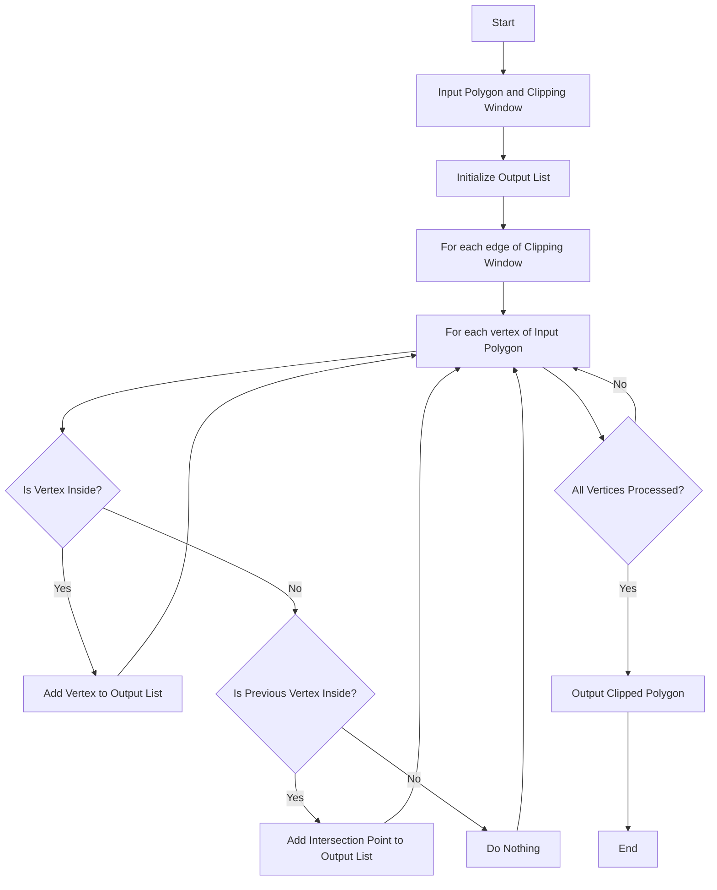

# graphics Algorithms

## Sutherland-Hodgman Polygon Clipping

```mermaid
graph TD
  A[Start] --> B[Input Polygon and Clipping Window]
  B --> C[Initialize Output List]
  C --> D[For each edge of Clipping Window]
  D --> E[For each vertex of Input Polygon]
  E --> F{Is Vertex Inside?}
  F -->|Yes| G[Add Vertex to Output List]
  F -->|No| H{Is Previous Vertex Inside?}
  H -->|Yes| I[Add Intersection Point to Output List]
  H -->|No| J[Do Nothing]
  G --> E
  I --> E
  J --> E
  E --> K{All Vertices Processed?}
  K -->|Yes| L[Output Clipped Polygon]
  K -->|No| E
  L --> M[End]
```